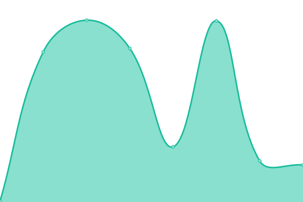
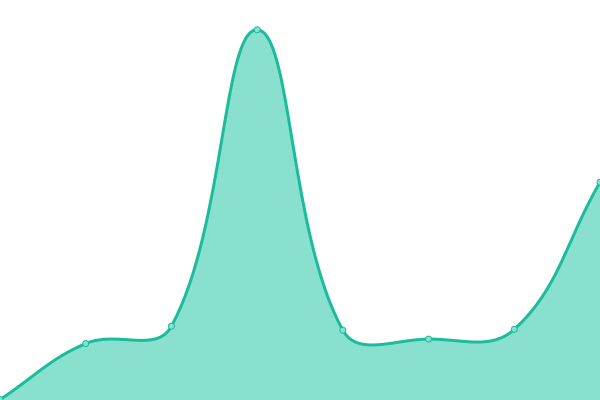

# [📈 Live Status](https://dcSpark.github.io/uptime): <!--live status--> **🟩 All systems operational**

This repository contains the open-source uptime monitor and status page for [dcSpark](https://dcspark.io), powered by [Upptime](https://github.com/upptime/upptime).

With [Upptime](https://upptime.js.org), you can get your own unlimited and free uptime monitor and status page, powered entirely by a GitHub repository. We use [Issues](https://github.com/dcSpark/uptime/issues) as incident reports, [Actions](https://github.com/dcSpark/uptime/actions) as uptime monitors, and [Pages](https://dcSpark.github.io/uptime) for the status page.

<!--start: status pages-->
<!-- This summary is generated by Upptime (https://github.com/upptime/upptime) -->
<!-- Do not edit this manually, your changes will be overwritten -->
<!-- prettier-ignore -->
| URL | Status | History | Response Time | Uptime |
| --- | ------ | ------- | ------------- | ------ |
|  [C1 Devnet RPC](https://rpc-devnet-cardano-evm.c1.milkomeda.com/liveness) | 🟩 Up | [c1-devnet-rpc.yml](https://github.com/dcSpark/uptime/commits/HEAD/history/c1-devnet-rpc.yml) | 

 205ms
     
 | 

<a href="https://dcSpark.github.io/uptime/history/c1-devnet-rpc">100.00%</a>
    

|  [C1 Devnet Sidechain Explorer](https://explorer-devnet-cardano-evm.c1.milkomeda.com) | 🟩 Up | [c1-devnet-sidechain-explorer.yml](https://github.com/dcSpark/uptime/commits/HEAD/history/c1-devnet-sidechain-explorer.yml) | 

 279ms
     
 | 

<a href="https://dcSpark.github.io/uptime/history/c1-devnet-sidechain-explorer">100.00%</a>
    

|  [C1 Mainnet RPC](https://rpc-mainnet-cardano-evm.c1.milkomeda.com/liveness) | 🟩 Up | [c1-mainnet-rpc.yml](https://github.com/dcSpark/uptime/commits/HEAD/history/c1-mainnet-rpc.yml) | 

 214ms
     
 | 

<a href="https://dcSpark.github.io/uptime/history/c1-mainnet-rpc">100.00%</a>
    

|  [C1 Mainnet Sidechain Explorer](https://explorer-mainnet-cardano-evm.c1.milkomeda.com) | 🟩 Up | [c1-mainnet-sidechain-explorer.yml](https://github.com/dcSpark/uptime/commits/HEAD/history/c1-mainnet-sidechain-explorer.yml) | 

 256ms
     
 | 

<a href="https://dcSpark.github.io/uptime/history/c1-mainnet-sidechain-explorer">100.00%</a>
    

<!--end: status pages-->

[**Visit our status website →**](https://dcSpark.github.io/uptime)

## 📄 License

- Powered by: [Upptime](https://github.com/upptime/upptime)
- Code: [MIT](./LICENSE) © [dcSpark](https://dcspark.io)
- Data in the `./history` directory: [Open Database License](https://opendatacommons.org/licenses/odbl/1-0/)
